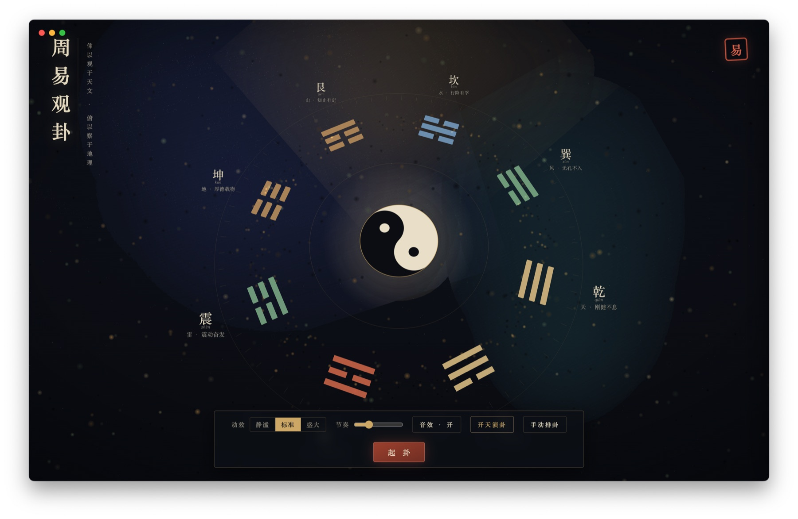

# 周易宇宙观卦

[](LICENSE)
[](https://github.com/reelos-ai/yi.reelos.ai/releases/latest)
[](https://github.com/reelos-ai/yi.reelos.ai/releases/latest)
[](https://github.com/reelos-ai/yi.reelos.ai/releases/latest)

一个以 Three.js 呈现八卦、六十四卦和三钱起卦过程的开源《周易》应用。包含完整 64 卦、384 条爻辞、动爻与变卦分析，并可结合具体问题调用本机 Grok CLI 或用户自己的 AI 模型进行个性化解读。

在线体验：[yi.reelos.ai](https://yi.reelos.ai)



## 安装包下载

| 平台 | 系统要求 | 下载 |
| --- | --- | --- |
| macOS | Apple Silicon，macOS 12+ | [下载 DMG](https://github.com/reelos-ai/yi.reelos.ai/releases/download/v1.1.0/yijing-cosmos-1.1.0-macos-arm64.dmg) |
| Windows | Windows 10/11 x64 | [下载安装程序](https://github.com/reelos-ai/yi.reelos.ai/releases/download/v1.1.0/yijing-cosmos-1.1.0-windows-x64.exe) |

安装包目前为社区未签名构建。macOS 首次启动请在 Finder 中右键应用并选择“打开”；Windows 若显示 SmartScreen，请确认发布者和 Release 校验值后选择“仍要运行”。

## 主要功能

- Three.js 三维八卦宇宙与完整起卦动画
- 三钱起卦、手动排卦、本卦、动爻和之卦分析
- 完整 64 卦、384 条爻辞及乾坤用九、用六
- 按事业、情感、财富、健康、抉择等问题生成行动型解读
- 支持本机 Grok CLI、Claude、GPT、Gemini、Kimi、MiniMax
- 支持自定义 OpenAI 兼容模型、模型名称和 API Base URL
- 一键生成并保存观卦海报
- Web、macOS 与 Windows 桌面端

## AI 模型配置

完成起卦后，点击“AI 深解”旁的设置按钮选择服务。

| 服务 | 默认模型 | 认证方式 |
| --- | --- | --- |
| Grok CLI | `grok-4.5` | 复用本机已登录的 CLI，无需在应用中填写 Key |
| Claude | `claude-sonnet-4-6` | 自备 Anthropic API Key |
| OpenAI | `gpt-4o-mini` | 自备 OpenAI API Key |
| Gemini | `gemini-2.5-flash` | 自备 Google AI API Key |
| Kimi | `kimi-k3` | 自备 Moonshot AI API Key |
| MiniMax | `MiniMax-M3` | 自备 MiniMax API Key |
| OpenAI 兼容 | 用户自定 | 按服务要求填写 API Key，无鉴权服务可留空 |

Kimi 默认使用 `https://api.moonshot.ai/v1`，也可改成国内端点 `https://api.moonshot.cn/v1`。MiniMax 默认使用 `https://api.minimax.io/v1`，国内端点可填写 `https://api.minimaxi.com/v1`。模型和端点可能随服务商更新，请以 [Kimi API 文档](https://platform.kimi.ai/docs/api/quickstart) 与 [MiniMax OpenAI 兼容文档](https://platform.minimax.io/docs/api-reference/text-openai-api) 为准。

API Key 只保存在当前设备的浏览器存储中，项目不会把 Key 上传到 ReelOS.AI。它并非系统钥匙串，不建议在公用设备上保存。纯静态网页无法调用本机 Grok CLI；请使用桌面端或 `npm start`。部分云服务可能限制浏览器跨域请求，遇到此情况建议使用桌面端或 OpenAI 兼容代理。

### 复用本机 Grok CLI

先在终端确认 Grok CLI 已安装、已登录且可运行：

```bash
grok --version
```

桌面端会自动查找 macOS 常见安装路径，以及 Windows 下 `~/.grok/bin/grok.exe`、`~/.local/bin/grok.exe`。也可以显式指定：

```bash
GROK_BIN=/path/to/grok GROK_MODEL=grok-4.5 npm start
```

## 本地开发

需要 Node.js 22+。

```bash
git clone https://github.com/reelos-ai/yi.reelos.ai.git
cd yi.reelos.ai
npm ci
npm start
```

浏览器访问 `http://127.0.0.1:4173/`。启动 Electron 开发版：

```bash
npm run desktop
```

## 构建桌面安装包

```bash
# macOS Apple Silicon，需要 macOS、Swift 与 hdiutil
npm run icon
npm run build:mac

# Windows x64，建议在 Windows 上构建
npm run build:win
```

产物位于 `dist/`。推送 `v*` 标签后，[GitHub Actions](.github/workflows/build.yml) 会分别在 macOS 与 Windows 构建，并上传到对应 Release。

## 项目结构

- `index.html`：自包含 Web 应用、Three.js 场景、交互与易学数据
- `server.mjs`：本地静态服务与 Grok CLI 桥接 API
- `electron/main.mjs`：跨平台 Electron 桌面入口
- `scripts/`：图标和 macOS DMG 构建脚本
- `.github/workflows/build.yml`：macOS/Windows 自动构建与发布

## 贡献与说明

欢迎提交 Issue 和 Pull Request。修改卦辞、爻辞或排卦逻辑时，请在 PR 中注明可靠出处并补充验证说明。古籍原文为公版内容，Three.js 内嵌代码保留其 MIT 许可声明，其余项目代码按 [MIT License](LICENSE) 开源。

AI 解读只用于辅助梳理处境和行动，不是宿命化预测，也不构成医疗、法律或投资建议。
